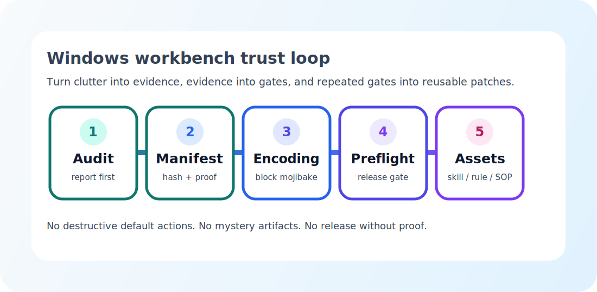
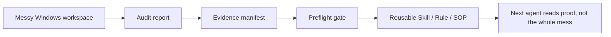

<div align="center">
  
  <h1>make_windows_silky_Patch</h1>
  <p><strong>Make Windows silky = save your tokens.</strong></p>
  <p>
    Windows AI 工作台的 token-saver 补丁包：把重复上下文、神秘安装包、缺证据发布、中文乱码和项目回看成本，压缩成脚本、门禁、清单和 AgentWorkOS 资产。
  </p>
  <p>
    <a href="./scripts">Scripts</a>
    ·
    <a href="./schemas/artifact-evidence.schema.json">Schema</a>
    ·
    <a href="./tests/Run-SmokeTests.ps1">Smoke Tests</a>
    ·
    <a href="./patches">AgentWorkOS Patches</a>
    ·
    <a href="./docs/examples/artifact-evidence.example.json">Example Manifest</a>
    ·
    <a href="./CHANGELOG.md">Changelog</a>
    ·
    <a href="./docs/release-preflight.md">Preflight</a>
    ·
    <a href="./docs/token-saver.md">Token Saver</a>
    ·
    <a href="./docs/windows-patch-10-factors.md">10 Factors</a>
    ·
    <a href="./docs/evidence-map.md">Evidence</a>
  </p>
  <p>
    
    
    
    
    
    
    
  </p>
</div>

<p align="center">
  
</p>

## 一句话

`make_windows_silky_Patch` 不是系统加速玄学包。它是给 Windows 上的 AI/product/dev 工作区准备的 **LLM token saver**。

它把 Agent 每次都要重新读、重新问、重新判断的东西固定下来：

| 反复烧 token 的问题 | 这个仓库把它变成 |
| --- | --- |
| “哪个 exe / zip 才是能发的？” | artifact evidence manifest + SHA256 + install/smoke 状态 |
| “这个仓库现在能不能发布？” | README、视觉证明、encoding gate、artifact gate 合并成 preflight |
| “这些重复安装包和 WebView2 残留是什么？” | report-first workspace audit |
| “中文 README / release note 会不会乱码？” | mojibake encoding gate |
| “同一个工作流又聊了一遍？” | Skill、Agent、Rule、Prompt、SOP |

下一次 Agent 进来时，不用再吞一整个混乱目录。它读报告、读 manifest、跑 gate，就能少花上下文、少猜状态、少返工。

## 30 秒开始

先跑仓库自检，确认脚本链路能工作：

```powershell
powershell -ExecutionPolicy Bypass -File .\tests\Run-SmokeTests.ps1
```

在任意 Windows 工作区生成顺滑审计报告：

```powershell
powershell -ExecutionPolicy Bypass -File .\scripts\Invoke-WindowsSilkyAudit.ps1 -Root "C:\path\to\workspace" -Days 14
```

给一个发布产物生成证据清单：

```powershell
powershell -ExecutionPolicy Bypass -File .\scripts\New-ArtifactEvidenceManifest.ps1 -Artifact ".\dist\App-v1.0.0-windows-x64.exe" -SmokeResult "pending"
```

校验证据清单：

```powershell
powershell -ExecutionPolicy Bypass -File .\scripts\Test-ArtifactEvidenceManifest.ps1 -Manifest ".\dist\App-v1.0.0-windows-x64.evidence.json"
```

查看公开示例 manifest：

```powershell
Get-Content .\docs\examples\artifact-evidence.example.json
```

发布前跑门禁：

```powershell
powershell -ExecutionPolicy Bypass -File .\scripts\Invoke-WindowsSilkyPreflight.ps1 -ProjectRoot .
```

## Patch Map

| Patch | 省下的 token | 入口 |
| --- | --- | --- |
| Workspace Silky Audit | 不再让 Agent 每次重新扫重复产物、WebView2 残留、入口缺失和编码风险 | [`scripts/Invoke-WindowsSilkyAudit.ps1`](./scripts/Invoke-WindowsSilkyAudit.ps1) |
| Artifact Evidence Manifest | 不再反复解释某个 EXE/ZIP 的来源、hash、冒烟状态和发布决策 | [`scripts/New-ArtifactEvidenceManifest.ps1`](./scripts/New-ArtifactEvidenceManifest.ps1) |
| Manifest Validator | 不再把“有个 JSON 文件”误当成“证据可信” | [`scripts/Test-ArtifactEvidenceManifest.ps1`](./scripts/Test-ArtifactEvidenceManifest.ps1) |
| Manifest Schema | 让证据格式能被工具、CI、Agent 共同理解 | [`schemas/artifact-evidence.schema.json`](./schemas/artifact-evidence.schema.json) |
| Example Manifest | 给公开仓库一个不含私有路径、token、cookie 的 evidence 示例 | [`docs/examples/artifact-evidence.example.json`](./docs/examples/artifact-evidence.example.json) |
| Encoding Gate | 不再到 README 截图、release note、GitHub 发布前才发现乱码 | [`scripts/Test-EncodingGate.ps1`](./scripts/Test-EncodingGate.ps1) |
| Windows Silky Preflight | 把 README、视觉证明、产物证据、manifest 校验、编码检查合成一个 gate | [`scripts/Invoke-WindowsSilkyPreflight.ps1`](./scripts/Invoke-WindowsSilkyPreflight.ps1) |
| Smoke Tests | 不再靠真实私有目录试脚本，临时 fixture 可重复验证核心链路 | [`tests/Run-SmokeTests.ps1`](./tests/Run-SmokeTests.ps1) |
| GitHub Actions Gate | 推送到 GitHub 后自动跑 smoke、preflight 和 diff hygiene | [`.github/workflows/windows-silky-preflight.yml`](./.github/workflows/windows-silky-preflight.yml) |
| AgentWorkOS Assets | 把重复经验变成 Skill、Agent、Rule、Prompt、SOP，后续直接复用 | [`patches/`](./patches) |

## Token Saver Loop



这就是这个仓库的主张：**不要把同一批杂乱上下文反复喂给模型；把它变成小而可信的证据。**

## Windows Patch 10 Factors

完整版本见 [`docs/windows-patch-10-factors.md`](./docs/windows-patch-10-factors.md)。

| Factor | 准则 | 一句话 |
| ---: | --- | --- |
| 1 | Evidence Before Cleanup | 先盘点，再清理 |
| 2 | Idempotent By Default | 重复运行不制造新混乱 |
| 3 | User-Controlled Destruction | 删除、移动、系统修改必须由用户明确确认 |
| 4 | One Canonical Artifact | 每组版本产物只保留一个当前可信件 |
| 5 | Evidence Beside Artifacts | 产物旁边必须有 hash、来源、冒烟、截图、决策 |
| 6 | Entrypoint First | 大项目先有 README 或 PROJECT_CARD |
| 7 | Encoding Is A Gate | 中文乱码是发布阻断项 |
| 8 | Proof Is Part Of Release | 截图、日志、release note 是发布定义 |
| 9 | Agent-Readable Assets | 脚本、清单、SOP、Rule、Skill 都要可被 Agent 复用 |
| 10 | Repetition Becomes Infrastructure | 重复两次写规则，三次做 Skill，阻塞发布就做门禁 |

## 提炼依据

本仓库从 `13-summarize-method-ablation` 的经验资产中只提取 Windows 顺滑相关内容，并只发布蒸馏后的证据。

| Evidence | Signal |
| --- | --- |
| Workspace scan | 24 个项目、68,310 个文件、100 个发布产物、293 个重复产物组、96 个无证据发布产物、44 个潜在编码问题 |
| Windows artifact clues | `RepoAtlas-v*-windows-x64.exe` 多版本重复、`.WebView2` 目录残留、`ChatGPT Installer` 多份重复、`gitmarket-windows_x86_64` 压缩包/EXE 分散 |
| Workflow clusters | Release/repo prep、visual proof、encoding cleanup、local model handoff、workflow assetization 反复出现 |

完整证据说明见 [`docs/evidence-map.md`](./docs/evidence-map.md)。

## 仓库结构

```text
make_windows_silky_Patch/
├─ scripts/        # Windows 审计、证据清单、manifest 校验、编码门禁、发布门禁
├─ schemas/        # evidence manifest JSON Schema
├─ tests/          # 无私有数据的 smoke fixture 测试
├─ .github/        # GitHub Actions preflight
├─ patches/        # Skill / Agent / Rule / Prompt 补丁
├─ checklists/     # 人类可执行检查表
├─ sops/           # 周期性工作台重置 SOP
├─ templates/      # evidence manifest 和 project card 模板
└─ docs/           # token saver、证据地图、10 Factors、升级路线、AgentWorkOS 提炼
```

## 适合谁

- Windows 上做很多本地 AI、移动端、桌面工具实验的人。
- 经常堆出多个 `*-windows-x64.exe`、`.zip`、`.WebView2`、`preview.html` 的人。
- 每次发布都要重新补 README、截图、release note、checksum 的人。
- 想让 Codex/AgentWorkOS 下次进入项目时少读上下文、多读证据的人。

## 不做什么

- 不自动删除文件。
- 不默认修改注册表、系统策略、电源计划、启动项或 Defender 设置。
- 不提交私有路径、token、cookie、原始 session log。
- 不把“建议”当成完成状态，必须落到脚本、清单、规则、Skill、SOP 或明确的 archive decision。

## 下一步

详细路线见 [`docs/upgrade-roadmap.md`](./docs/upgrade-roadmap.md)。高价值方向是 archive dry-run planner、PowerShell module、GitHub Action、HTML report 和 Codex hook candidate。

## License

MIT
